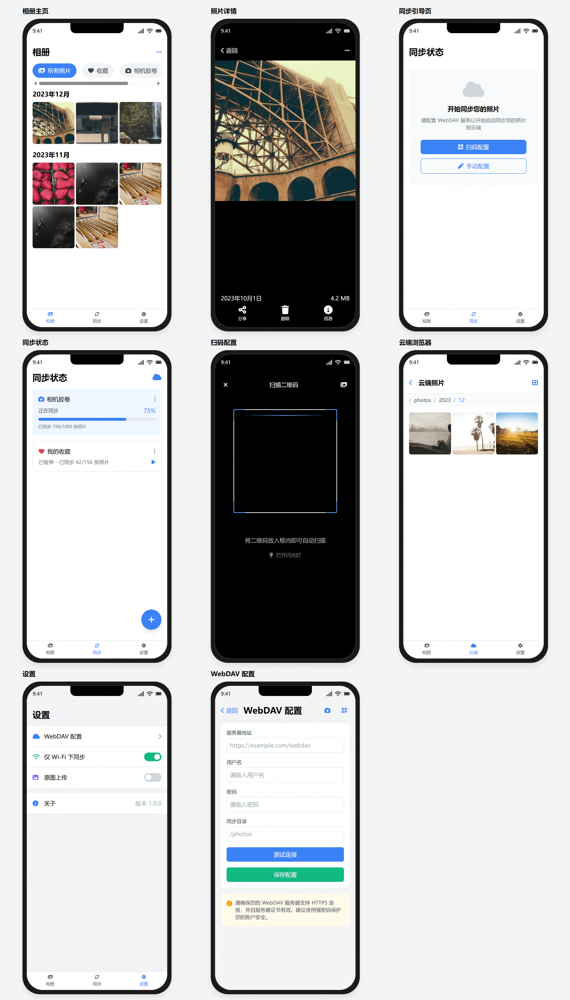

# OnlySync 相册同步助手

一个简单易用的相册同步工具,支持通过 WebDAV 将手机照片同步到私有云存储。

## 功能特性

- 📱 支持 iOS/Android 设备
- 🔄 WebDAV 协议同步
- 📂 灵活的同步任务管理
  - 支持按相册同步
  - 支持相机胶卷自动同步
  - 支持暂停/继续同步
- 🔍 云端照片浏览
- 🛠 便捷的配置方式
  - 扫码快速配置
  - 二维码分享配置
- ⚡️ 智能同步控制
  - 仅 WIFI 下同步
  - 原图/压缩可选

## 页面预览

### 相册主页
- 按日期分组展示照片
- 支持多相册切换
- 显示照片同步状态

### 同步管理
- 显示同步进度
- 支持暂停/继续同步
- 多任务并行同步

### WebDAV 配置
- 支持扫码配置
- 支持手动配置
- 配置参数分享

### 云端浏览
- 浏览已同步照片
- 按目录层级展示
- 支持列表/网格视图

### 更多功能
- 同步任务管理
- 照片详情查看
- Wi-Fi 控制
- 原图同步选项

## 开发计划

- [ ] 支持更多云存储协议
- [ ] 增加自动备份功能
- [ ] 添加相册分类功能
- [ ] 优化同步性能
- [ ] 支持视频同步

## 开发进度

当前处于原型设计阶段,完成了以下工作:

- [x] 页面原型设计
- [x] 交互流程设计  
- [x] WebDAV 协议调研
- [ ] Flutter 框架搭建
- [ ] 核心功能开发

## 贡献

欢迎提交 Issue 或 Pull Request。

## 许可

本项目采用 MIT 许可证。
